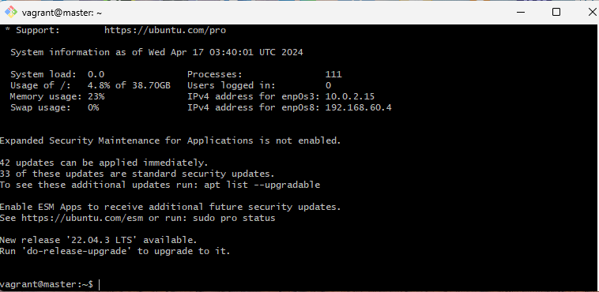
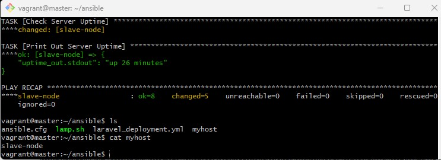
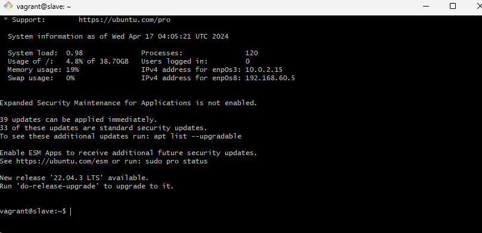
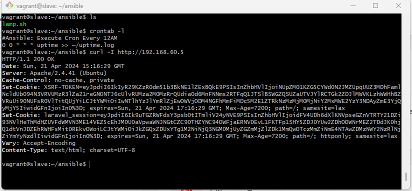
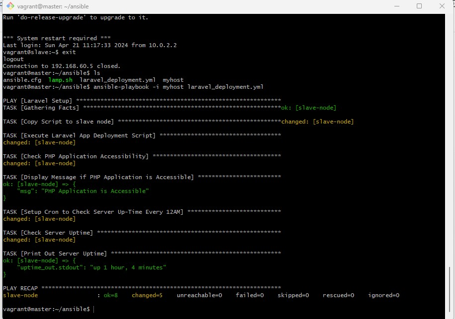
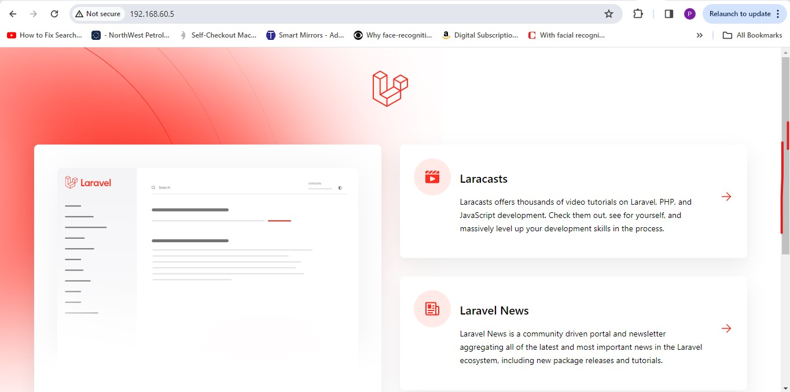

# Cloud Engineering Second Semester Examination Project

## (Deploy LAMP Stack)

## `Objective:`

- Automate the provisioning of two Ubuntu-based servers, named “Master” and “Slave”, using Vagrant.
- On the Master node, create a bash script to automate the deployment of a LAMP (Linux, Apache, MySQL, PHP) stack.
- This script should clone a PHP application from GitHub, install all necessary packages, and configure Apache web server and MySQL.
- Ensure the bash script is reusable and readable.

`Using an Ansible playbook:`

- Execute the bash script on the Slave node and verify that the PHP application is accessible through the VM’s IP address (take screenshot of this as evidence)
- Create a cron job to check the server’s uptime every 12 am.

## Task Overview

- The Vagrantfile used for provisioning the two Ubuntu-based server is attached with other files including snapshots of the deployments.

- The steps required to deploy a LAMP (stands for Linus, Apache, Mysql and PHP) stack laravel application using first,bash script and then ansible will be briefly outlined in this documentation.


### - Bash Script Task:

The required bash script is provided below with four default arguments provided when running the script.
The code is broken down into functions for reusability.

`lamp.sh`

```

#!/bin/bash

#!/usr/bin/bash

# echo display in green
green_echo() {
    echo -e "\e[32m$1\e[0m"
}

# usage instructions
usage() {
    green_echo "Usage: <github_repo_url> <mysql_root_password> <mysql_db_name> <mysql_username>"
    green_echo "Example: https://github.com/example/laravel-app.git mypassword app_db user"
    exit 1
}


# Check if required arguments are provided
if [ $# -ne 4 ]; then
    usage
fi

# Parse command line arguments
github_repo_url=$1
mysql_root_password=$2
mysql_db_name=$3
mysql_username=$4

lampStack_setup() {
    # Install PHP
green_echo "***************update and add php repository***************"

 sudo apt update
 sudo add-apt-repository ppa:ondrej/php -y

green_echo "***************installing PHP and  other dependencies***************"
 sudo apt install php8.2 -y
 sudo apt install -y php8.2 php8.2-curl php8.2-dom php8.2-mbstring php8.2-xml php8.2-mysql zip unzip

 green_echo "***************PHP installation complete!***************"

#Install Apache web server

green_echo "***************Installing Apache***************"

 sudo apt install apache2 -y
 sudo apt update
 sudo systemctl restart apache2

#Install Mysql-server

green_echo "***************Installing mysql-server***************"
sudo apt install mysql-server -y

# enable rewrite
sudo a2enmod rewrite
}

composer_install() {
cd ~
mkdir composer
cd composer
curl -sS https://getcomposer.org/installer | php
sudo mv composer.phar /usr/local/bin/composer
cd /usr/bin

green_echo "*************** Composer added successfully! ***************"
}

configure_laravelApp() {
cd ~
cd /var/www
sudo git clone $github_repo_url
sudo chown -R $USER:$USER /var/www/laravel
cd laravel

#Install dependencies using composer
composer install

#copy the content of the default env file to .env 
cp .env.example .env
sudo chown -R www-data storage
sudo chown -R www-data bootstrap/cache

}

mysql_db_setup() {
# configure mysql-server
sudo mysql -uroot -e "CREATE DATABASE $mysql_db_name;"
sudo mysql -uroot -e "CREATE USER '$mysql_username'@'localhost' IDENTIFIED BY '$mysql_root_password';"
sudo mysql -uroot -e "GRANT ALL PRIVILEGES ON $mysql_db_name.* TO '$mysql_username'@'localhost';"

# Edit laravel .env file
cd /var/www/laravel
sudo sed -i "24 s/^# *//g" /var/www/laravel/.env
sudo sed -i "25 s/^# *//g" /var/www/laravel/.env
sudo sed -i "23 s/^# *//g" /var/www/laravel/.env
sudo sed -i "26 s/^# *//g" /var/www/laravel/.env
sudo sed -i "27 s/^# *//g" /var/www/laravel/.env
sudo sed -i '22 s/=sqlite/=mysql/' /var/www/laravel/.env
sudo sed -i '23 s/=127.0.0.1/=localhost/' /var/www/laravel/.env
sudo sed -i '24 s/=3306/=3306/' /var/www/laravel/.env
sudo sed -i "25 s/=laravel/=$mysql_db_name/" /var/www/laravel/.env
sudo sed -i "26 s/=root/=$mysql_username/" /var/www/laravel/.env
sudo sed -i "27 s/=/=$mysql_root_password/" /var/www/laravel/.env

sudo php artisan key:generate 
sudo php artisan storage:link
sudo php artisan migrate          #migrates database
sudo php artisan db:seed
sudo systemctl restart apache2

green_echo "*************** database setup complete! ***************"
}

apache_conf() {
cd ~
cd /etc/apache2/sites-available/
sudo touch laravel.conf
sudo echo '<VirtualHost *:80>
    ServerName 192.168.60.5
    DocumentRoot /var/www/laravel/public

    <Directory /var/www/laravel>
        AllowOverride All
    </Directory>

    ErrorLog ${APACHE_LOG_DIR}/laravel-error.log
    CustomLog ${APACHE_LOG_DIR}/laravel-access.log combined
</VirtualHost>' | sudo tee /etc/apache2/sites-available/laravel.conf

# activate laravel.conf
sudo a2ensite laravel.conf
sudo systemctl restart apache2

}

# functions
main(){
lampStack_setup
composer_install
configure_laravelApp
apache_conf
mysql_db_setup
}

# execute functions
main
green_echo "***************laravel app deployed!***************"

```

### - Ansible playbook

The ansible playbook is provided below

`laravel_deployment.yml`

```
---
- name: Laravel Setup
  hosts: slave-node
  tasks:
    - name: Copy Script to slave node
      copy:
        src: lamp.sh
        dest: ~/ansible/lamp.sh
        mode: 0755

    - name: Execute Laravel App Deployment Script
      shell: ~/ansible/lamp.sh https://github.com/laravel/laravel.git passwd123 Test jane

    - name: Check PHP Application Accessibility
      command: curl http://192.168.60.5
      register: php_app_response
      ignore_errors: true

    - name: Display Message if PHP Application is Accessible
      debug:
        msg: "PHP Application is Accessible"
      when: php_app_response.rc == 0

    - name: Setup Cron to Check Server Uptime Every 12AM
      cron:
        name: "Execute Cron Every 12AM"
        minute: "0"
        hour: "0"
        job: "uptime >> ~/uptime.log"

    - name: Check Server Uptime
      command: uptime -p
      register: uptime_out

    - name: Print Out Server Uptime
      debug:
        var: uptime_out.stdout


```
## << Deployment snapshots >>

## Vagrant Ubuntu server deployments

## Master Node



## Slave Node



## ** Ansible Playbook deployment **



## Laravel App Page on browser


